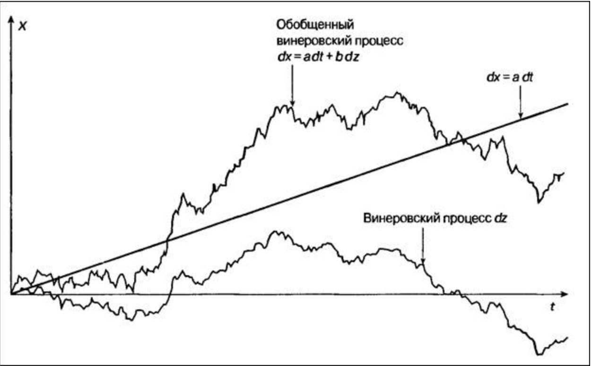
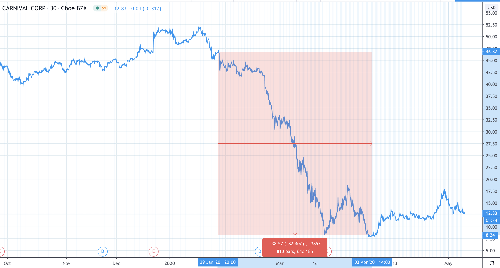
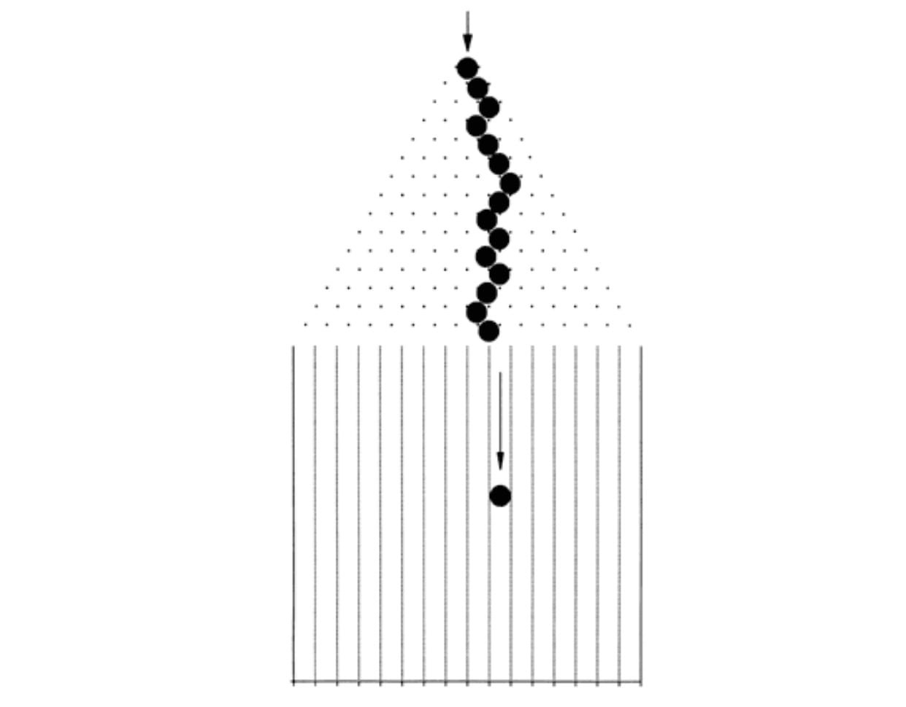
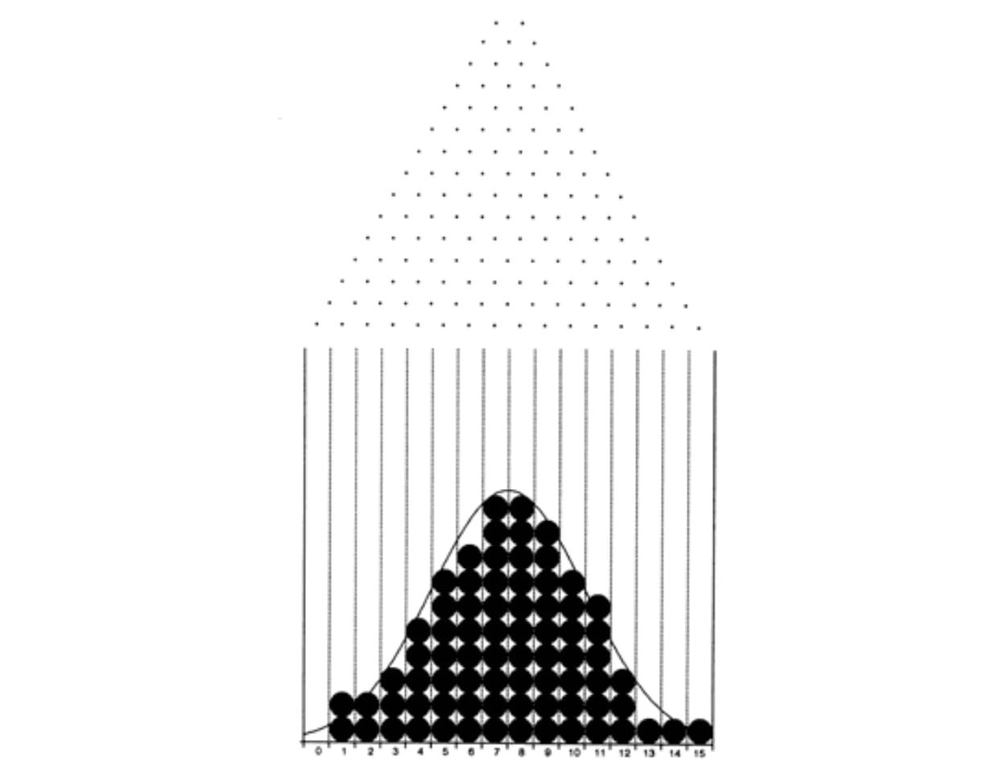
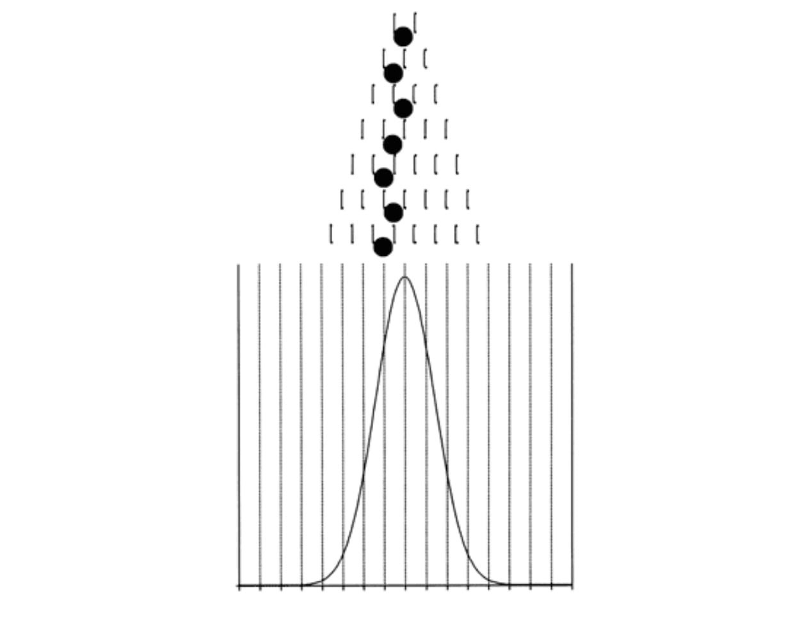
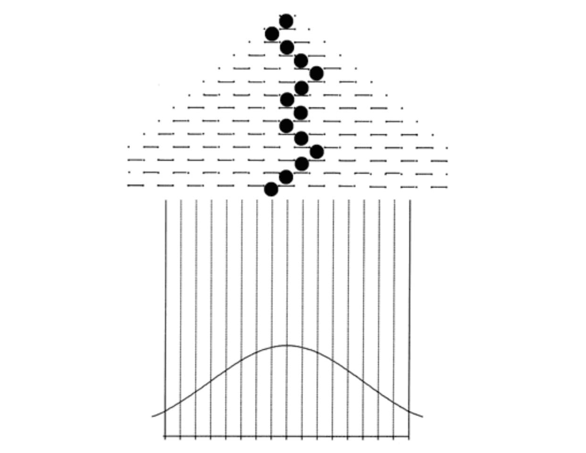

# stock_prediction
В наши дни все больше людей вкладывают свои средства в инвестции, в связи с этим возникает проблема: Как найти интересные инструмены для инвестирования и как предсказать как они будут вести себя в будущем? Чтобы ответить на этот вопрос, обратимся к моделям из курса по случайным процессам. Для начала поймем, каким процессом описываетя курс акций, валют. Если значения переменной непредсказуемо меняются во времени, то говорят что она подчиняется $\textbf{стохастическому процессу (stohastic process)}$.

Попробуем найти формулу, с помощью которой можно предсказать стоимость акции. Для этого введём несколько определений.

$\textbf{Стохастический процесс} -$ это процесс, в котором одной из случайных величин является время.
Различают стохастические процессы с $\textbf{дискретным}$ и $\textbf{непрерывным}$ временем. Первые имеют место в случае, когда значения переменной изменяются только в фиксированные моменты времени. В процессе с непрерывным временем это может происходить в любой момент.
 
Также существует деление самих стохастических процессов на дискретные и непрерывные. В случае дискретного стохастического процесса переменная принимает значения из конечного (счетного) набора. В непрерывном случае – из некоторого диапазона.
 
Рассмотрим непрерывный стохастический процесс с непрерывным временем, описывающий изменение цены акции.

$\textbf{Марковский процесс -}$ это стохастический процесс, в котором будущее значение переменной зависит только от ее предшествующего значения и не зависит от всех остальных предшествующих значений.

Случайная величина $Z$ подчиняется винеровскому процессу, если: Случайная величина $Z$ подчиняется Марковскому процессу и $\Delta Z = \varepsilon \cdot \sqrt{t}$
$\Delta Z $ $\mapsto$ $0$ и $\varepsilon$ $\sim$ $N(0,1)$.
Мы стартуем не из $0$. Суть процесса не особо меняет, что мы стартуем из произвольной точки

В силу определения марковского процесса величины $\Delta Z$ являются независимыми, следовательно, при $\Delta t$ $\mapsto$ $0$ имеем: $\Delta Z$ $\mapsto$ к винеровскому процессу $dZ$.

$\textbf{Обобщённый винеровский процесс}$ для случайно величины!!!! $X$ задаётся уравнением: $dX = a\cdot dt + b\cdot dZ $ $\text{ }  $ $\textbf{(1)}$, где $a,b$ константы.

Если $b=0$, то уравнение примет вид $dX=a \cdot dt$, откуда $X=X(0)+ a \cdot t$.

$b \cdot dZ$ будем рассматривать как шум ,в $b$ раз превосходящий значение винеровского процесса $dZ$.
Из свойста винеровского процесса получаем, что $\Delta Z$ $= a \cdot dt + b\cdot $$\varepsilon$$ \cdot \sqrt{t}$.

$\textbf{Стохастический процесс Ито}$ - это обобщённый винеровский процесс, в котором параметры $a$ и $b$ являются функциями случайной величины  $x$ и времени $t$.

$dx = a(x,t)\cdot dt + b(x,t)\cdot dz$ $\text{  }$ $\textbf{(2)}$

Введем обозначения. $S$ - цена акции в момент времени. $t$,  $\mu$ - ожидаемый уровень доходности
Если волатильность акции равна $0$, то $\Delta S = \mu\cdot S\cdot dt$. При $\Delta t \mapsto 0$, получим $dS = \mu \cdot S\cdot dt$.

Но в жизни волтильность почти всегда больше $0$. Поэтому предположим, что изменение доходности постоянно и не зависит от цены акции, тогда:
$${{\textbf{dS}}\over{\textbf{S}}} = \mu\cdot dt + \sigma\cdot dz$$

Таким образом мы получили формулу Ито, которая широко используется для моделирования цены акции.

Мы получили формулу, с помощью которой можем делать прогнозы, но давайте разберемся и поймем что представляют из себя главные коэффицента в этом уравнении.

Начнем с коэффицента $\sigma$, который отвечает за волатильность финансового актива. Что такое волатильность и почему она так важна для инвестиционного аналитика? В определенном смысле волатильность - это показатель темпа изменения рыночной цены. Рынки, цены на которых меняются медленно, называют низковолатильными, а рынки, цены на которых меняются быстро - высоковолатильными. Для примера можем рассмотреть акции компании Carnival, которая занимается круизами в США. На фоне пандемии акции этой компании упали на более чем $80$%

Можно сказать, что компания была на грани банкровства, ведь правительство США не поддержало финансово круизные компании из-за того, что они юридически оформлены в странах карибского водоёма. Но если мы посмотрим, то мы можем увидеть, что акции выросла с 8 до 16 долларов за короткий промежуток. Это произошло из-за того, что у компании появились крупные инвесторы из Саудовской Аравии. Согласитесь хорошая инвестиция, но с таким уже успехом этих инвесторов могло бы и не быть и тогда бы компания действительно была бы на грани банкровства. При принятии решения об инвестировании в эту компании мы непременно смотрим на ее предысторию и в данном случае мы видим, что такая инвестиция имеет высокий риск. Таким образом мы пришли к определению волатильности. Волатильность - это мера риска. Если волатильность акции высокая, то и прибыльность такой инвестиции будет выше, но вероятность получения прибыли будет ниже чем если бы мы вложились в высоконадежные государственные облигации, получим гарантированный купонный доход.

Количественное определение волатильности строится на случайном блуждании и нормальном распределении. Возьмем для примера игру в пинг-понг. Шарик катится вниз через частокол штырьков.

Наткнувншись на штырек, он отклоняется вправо или влево равновероятно. После этого шарик попадает на новый уровень, где натыкается на другой штырек. Наконец, внизу он попадает в одну из лунок. Движение шарика через частокол штырьков называют $\textbf{случайным блужданием}$. Как только шарик попадает в этот частокол, никто не может повлиять на его траекторию, равно как и предсказать эту траекторию.

Если бросить достаточное число количество шариков, то распределение будет описываться колокообразной кривой, как на рисунке

Большинство шариков попадает в центр; чем дальше расположены лунки от центра, тем меньше шариков в них оказывается. Такое распределение называют  $\textbf{нормальным}$ или $\textbf{колокообразным}$

Давайте слегка изменим условия игры, поставив вертикальные перегородки таким образом, что теперь, наткнувшись на штырек и отклонившись влево или вправо, шарик опустится до соприкосновения со следующим штырьком не на один, а на два уровня. Если бросить достаточное количество шариков, то получится распределение, представленное на рисунке ниже

Так как боковые движения шариков ограничены, пик этой кривой будет выше, а ее края будут более узкими, чем у прошлой колообразной кривой.

Наконец, мы можем поставить горизонтальные перегородки так, что, попадая на следующий уровень, шарик будет каждый раз отклоняться на два штырька влево или вправо. И снова, если бросить достаточное количество шариков, то получится распределение, представленное на рисунке ниже:

У этой кривой, которая отражает нормальное распределение, пик намного ниже и хвосты убывают намного медленее, чем на прошлых кривых. Пусть боковые движения шарика символизируют повышательные и понижательные изменения цены актива, а движение вниз - течение времени. Если предположить, что цена актива повышается или понижается каждый день на доллар, то распределение будет как на рис.3. А если предположить, что цена за день растет и падает на 2 доллара, то распределение будет как на рис.4.

Если исходить из того, что изменения цен актива носят случайны характер, и ничего не говорить о веротяном направлении изменения, то можно утверждать, что кривые отражают распределения значений цен соотвественно на умеренном, низковолатильным и высоковолатильном рынке. На низковолатильном рынке цены колеблются в узком диапазоне, а следовательно, изменения цены актива невыскои. На высоковолатильном рынке веротяность резкого изменения цен намного больше и цена может сильно меняться.

Определив понятие волатильности, введём формулу для её расчёта:

$$\sigma = \sqrt{\frac{365 \cdot \sum\limits_{i=1}^n (x_i - m)^2  }{(n-1)\cdot n}}$$

где:

$m$ - математическое ожидание

$n$ - количество дней

$x_i$ - стандартное отклонение логарифмических изменений цен

Мы получили формулу для расчета волатильности. Попробуем получить формулу для расчета $\mu$ - доходности актива.

Будем использовать финансовую модель CAPM для расчёта доходности.

Если все инвесторы на рынке имеют одина- ковые рыночные портфели, то каким образом выражается реакция инвесто- ров, обусловленная неприятием риска в совершаемых ими инвестициях? В модели оценки финансовых активов, когда инвесторы при распределении средств решают: сколько им следует вложить в безрисковый актив, а сколько в рыночный портфель, они опираются на свои предпочтения в обла- сти риска. Инвесторы, избегающие риска, могут принять решение вложить все свои сбережения в безрисковый актив. Инвесторы, желающие принять на себя больше риска, вложат значительную часть своих сбережений, или даже все, в рыночный портфель. Инвесторы, уже вложившие все свои сред- ства в рыночный портфель и, тем не менее, желающие принять на себя еще больше риска, могли бы добиться этого, заняв средства по безрисковой ставке и инвестировав их в тот же самый рыночный портфель, следуя примеру всех остальных. Данные предположения основываются на двух дополнительных допущениях. Во-первых, существует безрисковый актив, ожидаемый доход которого известен с абсолютной определенностью. Во-вторых, инвесторы могут ссужать и занимать средства по безрисковой ставке для достижения оптимальности размещения средств. В то время как ссуда по безрисковой ставке не доставляет особых проблем (индивиду для этого достаточно приобрести казначейские векселя или казначейские облигации), получение ссуд по безрисковой ставке может оказаться куда более затруднительным для отдельного лица. Существуют версии модели CAPM, позволяющие несколько смягчить эти допущения и, тем не менее, получить выводы, совместимые с моделью.

Риск любого актива для инвестора — это риск, добавляемый данным активом к портфелю инвестора в целом. В мире САРМ, где все инвесторы владеют рыночным портфелем, риск отдельного актива для инвестора — это риск, который данный актив добавляет к рыночному портфелю. На интуитивном уровне понятно, что если движение актива происходит независимо от рыночного портфеля, то этот актив не добавит слишком уж много риска к рыночному портфелю. Другими словами, большая часть риска данного актива является специфическим риском фирмы, а потому может быть диверсифицирована. С другой стороны, если стоимость актива имеет тенденцию к росту одновременно с повышением стоимости портфеля, равно как и тенденцию к падению при снижении стоимости рыночного портфеля, то актив увеличивает риск портфеля. Такой актив обладает в большей степени рыночным риском и в меньшей — специфическим риском фирмы. Статистически, добавленный риск измеряется ковариацией актива с рыночным портфелем.

Ковариация измеряется в процентах, поэтому трудно вынести решение по поводу относительного риска инвестиции, основываясь на ее значении.По этой причине мы стандартизируем меру риска путем деления ковариации каждого актива с рыночным портфелем на дисперсию рыночного портфеля. Это позволяет получить показатель риска, который называется коэффициентом бета (beta) данного актива:

$$\beta_i = \frac{\text{Ковариация актива i с рыночным портфелем}}{\text{Дисперсия рыночного портфеля}}$$

Поскольку ковариация рыночного портфеля с самим собой является его дисперсией, бета рыночного портфеля (как и его среднего актива) равна 1. Активы, чья рискованность выше среднего уровня (если использовать эту меру риска), будут иметь коэффициент бета выше единицы, а активы, которые безопаснее среднего уровня, будут обладать бетой менее единицы. У безрисковых активов коэффициент бета равен нулю.

Факт удержания каждым инвестором некоторой комбинации безрискового актива и рыночного портфеля приводит к заключению, что ожидаемый доход на актив линейно зависит от беты актива. В частности, ожидаемый доход на актив можно записать как функ- цию безрисковой ставки и беты этого актива

$$\mu = R - \sigma \cdot(m - R) $$ где:

$\mu$ - доходность

$R$ - безрисковая ставка (как правило за безрисовкую ставку берут ставку государственных облигаций)

$\sigma$ - волатильность актива

$m$ - средняя доходность актива

Таким образом мы определили формулу для расчета доходности. Теперь мы можем проверить наши предположения на расчёте будущей цены акции. В качестве примера, расчитаем прогнозую цены для российской энергетической компании Интер РАО ЕЭС с тикером на бирже $\textbf{IRAO.ME}$. 
За безрисковую ставку возьмем государственные бумаги, средняя доходность по ним составляет $\textbf{7%}$

Для расчета доходности выгрузим данные, нам интересны цены акции за промежуток времени и стоимость главного индекса в стране, в которой акции компании торгуются
